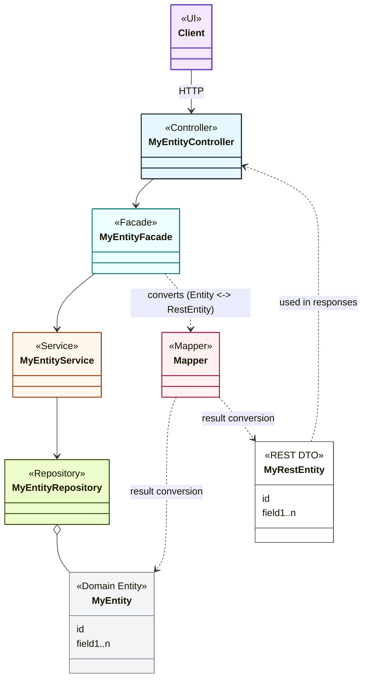

# Java Backend

## AI Agent Skills

The following skills are particularly relevant when working on the backend:
- [**Entity Creation & Update (Backend Phases)**](../.github/skills/entity-creation-update/SKILL.md#phase-1---domain-entity-setup---data-access-layer): Phases 1 through 4 cover everything from the data model to REST API and query capabilities.
- [**Query Filtering**](../.github/skills/query-filtering/SKILL.md): Adding Lucene-like query filtering support to entity endpoints.
- [**Bulk Operations**](../.github/skills/bulk-operations/SKILL.md): Implementing bulk create-or-update operations with smart field matching or natural key matching.
- [**Security & RBAC (Backend)**](../.github/skills/security-rbac/SKILL.md#backend-implementation): Implementing permission-based access control and JWT authentication.
- [**Postman Collection Tester**](../.github/skills/postman-collection-tester/SKILL.md): Running and updating integration tests for the REST API.
- [**Translation**](../.github/skills/translation/SKILL.md): Managing backend translations in `MessageKeys.java` and initialization JSON files.

## Technology Stack

- Java 17
- Spring Boot 3.x
- Gradle 8.8
- MapStruct for DTO mapping
- Spring Web, Spring Data JPA
- PostgreSQL (or configurable DB)
- RESTful API design
- SpringDoc OpenAPI 3.0 (Swagger UI available at `/swagger-ui.html`)

## Project Structure

```
service/            
├── src/
│   └── main/
│       ├── java/
│       │   └── de/
│       │       └── ebusyness/
│       │           ├── commons/
│       │           └── priceprovider/
│       │               ├── dataaccess/
│       │               ├── facade/
│       │               ├── service/
│       │               └── web/
│       │                   └── controller/
│       └── resources/
│           └── application.yml
├── postman/pps-postmancollection.json
├── build.gradle
├── Dockerfile
└── dockerimage-create.sh / dockerimage-create.bat
```

## Documentation

For detailed architecture documentation, development guide, and implementation examples, see:
- [Architecture Documentation](doc/) - Comprehensive architecture and design documentation
- [Development Guide](doc/020-development/010-development-guide.md) - Development guides with layer-specific patterns and examples

## Architectural Layers

| Layer            | Package                                     | Responsibility                                                                 |
|------------------|---------------------------------------------|--------------------------------------------------------------------------------|
| Commons          | `de.ebusyness.commons`                      | Shared utilities, interfaces, exception handling                              |
| Data Access      | `de.ebusyness.priceprovider.dataaccess`     | Repositories, JPA entities, REST clients (external REST access), typical classes (Entity)Repository, Entity, (View)Projection                           |
| Service          | `de.ebusyness.priceprovider.service`        | Domain Services, Business Services, typical classes (Entity)Service, (Entity)ImportJob, (Businesslogic)Service                       |
| Facade           | `de.ebusyness.priceprovider.facade`         | RestEntity mapping, service delegation, response shaping, typical classes (Entity)Facade, (Entity)Mapper, (Entity)RestEntity                           |
| Web              | `de.ebusyness.priceprovider.web.controller` | REST controllers, input validation, API contracts , typical classes (Entity)Controller, (Type)Validator                            |


### Diagram 



### Mapper Usage

To convert between entity and REST entity types, use a mapper class that extends `AbstractMapper`. 

**Key Concepts**:
- All REST entities extend `RestEntity<INFO_TYPE, INCLUDES_TYPE>`
- Mappers extend `AbstractMapper<SourceEntity, TargetRestEntity, MappingContext>`
- Implement `createTarget()` and `convert()` methods

For detailed implementation examples, see [Development Guide - Mapper Implementation](doc/020-development/013-development-guide-facade-layer.md#creating-a-mapper).

### PatchMapper Usage

PatchMapper applies JSON Patch operations (RFC 6902) to REST entities.

**Implementation Steps**:
1. Register `PatchMapper<T>` beans in configuration using `GenericPatchMapper`
2. Inject `PatchMapper<T>` into facades via constructor injection
3. Call `applyPatch(patch, target)` to apply patch operations

For detailed implementation examples and architecture diagrams, see [Development Guide - PatchMapper Implementation](doc/020-development/013-development-guide-facade-layer.md#patchmapper-implementation).


## Development Best Practices

- Use constructor injection (no field injection)
- Keep services stateless and focused
- Use RestEntities (DTOs) in web/facade layers, never expose entities
- Use `@Validated` and `@Valid` for input validation
- Apply lazy loading in the persistence layer to optimize data access. Use @Transactional at the boundaries of the facade or business service layers to ensure all operations are properly wrapped in a transaction.
- **Follow Interface Driven Design (IDD) principles**: All service classes should implement interfaces to promote loose coupling, testability, and maintainability.

### Validation and Exception Handling

**Validation:**
- Use `ValidationRule<T>` implementations (annotated with `@Component`) for all domain validation
- Service layer automatically injects and executes all validation rules via `EntityValidator<T>`
- Validation failures throw `EntityValidationException` with detailed `Message` objects
- Always use message keys (from `MessageKeys` constants) with parameters for error messages
- Include field references in `Message` objects to help UI highlight errors

**Exception Handling:**
- **Use checked exceptions** for all domain and business errors (extend `Exception`, not `RuntimeException`)
- **Declare exceptions in method signatures** - don't catch and suppress them
- **Propagate exceptions through the call stack** - let them bubble up from service → facade → controller
- **Handle exceptions centrally in `ExceptionHandlerAdvice`** - this is the single point where exceptions are converted to HTTP responses
- Standard exception types: `NotFoundException` (404), `EntityValidationException` (400), `DataIntegrityException` (409), `EntityAlreadyExistsException` (409), `InvalidParameterException` (400), `DataMappingException` (400)
- Never include HTTP status codes in `Message` objects - status codes belong only in HTTP response headers

## Interface Driven Design (IDD) Principles

This project follows Interface Driven Design (IDD) principles to ensure maintainability, testability, and flexibility:

### Core Principles

1. **Design by Contract**
   - Interfaces act as formal contracts between components
   - They specify expected behavior without revealing internal implementation
   - Example: `UnitService` interface defines the contract, `UnitServiceImpl` provides the implementation

2. **Separation of Concerns**
   - Each component focuses on a single responsibility
   - Interfaces help isolate logic, making systems easier to maintain and evolve

3. **Loose Coupling**
   - Components interact via interfaces, not concrete classes
   - This decoupling allows for easier testing, mocking, and replacement
   - Dependencies are injected as interfaces (e.g., `UnitService` not `UnitServiceImpl`)

### Implementation Pattern

**Service Layer Structure:**
```
service/
├── unit/
│   ├── UnitService.java              # Interface defining the contract
│   ├── UnitServiceImpl.java          # Default implementation
│   ├── validation/
│   └── setup/
```

**Key Concepts:**
- Interfaces define contracts (e.g., `UnitService`)
- Implementations provide concrete behavior (e.g., `UnitServiceImpl`)
- Always depend on interfaces in constructors, not implementations
- Use `@Service` for implementations and constructor injection for dependencies
- Multiple implementations can coexist using `@Primary` and `@Qualifier`

For detailed implementation examples and patterns, see [Development Guide - Interface Driven Design](doc/020-development/012-development-guide-service-layer.md#interface-driven-design-idd-in-the-service-layer).

### IDD in Other Layers

Interface Driven Design is applied consistently across all architectural layers:

**Facade Layer:**
- All facades follow the *FacadeService interface and *FacadeImpl implementation pattern
- Controllers depend on facade interfaces (e.g., `UnitFacadeService` not `UnitFacadeImpl`)
- Example: `UnitFacadeService` ← `UnitFacadeImpl`

**Infrastructure Layer:**
- Validators: `Validator<T>` ← `EntityValidator<T>`
- Patch Validators: `PatchValidatorService` ← `PatchValidator`
- Managers: `DataImportManager` ← `SetupDataImportManager`, `DatabaseUpdateManager` ← `DBUpdateTaskManager`

**Benefits Across All Layers:**
- Controllers, facades, services all benefit from loose coupling
- Every layer can be easily tested with mocks
- Alternative implementations can be swapped at any layer
- Consistent architectural pattern throughout the codebase

For comprehensive facade and infrastructure IDD examples, see [Development Guide - IDD in Facade Layer](doc/020-development/013-development-guide-facade-layer.md#idd-in-the-facade-layer) and [IDD in Infrastructure Layer](doc/020-development/012-development-guide-service-layer.md).

# REST API Principles

**Typical URL patterns** for accessing resources:
- `/api/{domain-entity-plural}/{id}` – single entity by ID
- `/api/{domain-entity-plural}/{id-part-1}/{id-part-2}/.../{id-part-n}` – composite key access

## HTTP Method Semantics

| Method | Purpose                                      | Notes                                                                 |
|--------|----------------------------------------------|-----------------------------------------------------------------------|
| GET    | Retrieve a resource or list of resources     | Returns 200 (OK) on success, 404 (Not Found) if resource doesn't exist |
| PUT    | Create or fully replace a resource           | **Use for create operations when ID is known/defined by consumer**<br/>Should be idempotent and side-effect free<br/>Resource ID **must** be provided via URL path parameter only<br/>Request body must **not** contain the ID field<br/>Returns 200 (OK) for updates, can return 201 (Created) for new resources |
| PATCH  | Partially update a resource                  | **Use for update operations** (preferred over PUT for modifications)<br/>Applies JSON Patch operations (RFC 6902)<br/>Resource ID provided via URL path parameter only<br/>Request body contains JSON Patch operations array<br/>Returns 200 (OK) on success, 400 (Bad Request) for validation errors, 404 (Not Found) if resource doesn't exist |
| DELETE | Remove a resource                            | Resource ID must be provided via URL<br/>Returns 204 (No Content) on success, 404 (Not Found) if resource doesn't exist, 409 (Conflict) if deletion not possible due to constraints |
| POST   | Create new entities or perform custom actions | **Always use descriptive verb in URL**: `POST /api/{domain-entity-plural}/{verb}`<br/>**For single entity creation**: `POST /api/{domain-entity-plural}/create` (ID generated server-side, not in request body)<br/>**For bulk operations**: `POST /api/{domain-entity-plural}/createOrUpdateAll` (ID allowed in request body for updates, max 100 items)<br/>**For custom actions**: `POST /api/{domain-entity-plural}/deleteAll` (bulk delete)<br/>Returns 200 (OK) with created entity/entities, 400 (Bad Request) for validation errors, 409 (Conflict) for duplicate keys |

## REST Entity Structure

### Single Entity Response
A single REST entity response contains the entity identifier and its domain fields plus optional metadata ($info, $includes, $messages):

```code
{
  "id": (identifier type or entity-reference-type),
  "entityField1": (field type),
  "entityField2": (field type),
  ...
  "entityFieldN": (field type),
  "$info": { /* Optional metadata, e.g. calculated or derived fields */ },
  "$includes": { /* Optional embedded or related data */ },
  "$messages": [ /* Optional informational or warning messages */ ]
}
```

### List of Entities Response
A list response returns an array of REST entities and an $info object with paging and sorting metadata. Plus optional metadata ( $includes, $messages):

```json5
{
  "items": [ /* Array of REST entity objects */ ],
  "$info": {
    "paging": {
      "page": 0,              // Current page number (0-based)
      "page-size": 10,        // Number of items per page
      "total-items": 24,      // Total number of items across all pages
      "total-pages": 3        // Total number of pages
    },
    "sorting": {              // Optional: Present only when sorting is applied
      "sort-by": ["field1", "field2"],  // List of fields to sort by
      "sort-direction": "asc"           // Sort direction: "asc" or "desc"
    }
  },
  "$includes": { /* Optional embedded or related data */ },
  "$messages": [ /* Optional informational or warning messages */ ]
}
```

**Query Parameters for List Endpoints**:
- `page` (optional, default: 0) – Page number (0-based)
- `page-size` (optional, default: 10) – Number of items per page
- `sort-by` (optional) – Field name(s) to sort by. Can be repeated for multi-field sorting
- `sort-direction` (optional, default: "asc") – Sort direction: "asc" or "desc"

**Examples**:
```
GET /api/units?page=0&page-size=10
GET /api/units?page=1&page-size=20&sort-by=symbol&sort-direction=desc
GET /api/units?sort-by=symbol&sort-by=factor&sort-direction=asc
```

**Sortable Fields by Endpoint**:

**Units (`/api/units`)**:
- `symbol` – Unit symbol (e.g., "m", "kg", "l")
- `name` – Unit name (localized, sorting uses default locale)
- `measure` – Measurement type (e.g., "length", "mass", "volume")
- `baseUnitRef` – Base unit reference
- `factor` – Conversion factor to base unit

Example:
```
GET /api/units?sort-by=measure&sort-direction=asc
GET /api/units?sort-by=name&sort-direction=desc
```

**Price Rows (`/api/pricerows`)**:
- `id` – Price row ID
- `pricedResourceId` – Resource identifier
- `priceValue` – Price amount
- `minQuantity` – Minimum quantity
- `unitRef.symbol` – Unit symbol (for sorting by associated unit)
- `currency` – Currency code (e.g., "EUR", "USD")
- `taxIncluded` – Tax inclusion flag (boolean)
- `validFrom` – Valid from timestamp
- `validTo` – Valid to timestamp
- `customerId` – Customer identifier

Example:
```
GET /api/pricerows?sort-by=pricedResourceId&sort-direction=asc
GET /api/pricerows?sort-by=minQuantity&sort-direction=desc
GET /api/pricerows?sort-by=currency&sort-direction=asc
GET /api/pricerows?sort-by=validFrom&sort-direction=desc
```

### RestEntity ID Field Convention

**Important**: RestEntities must use a simplified `id` field for API communication, even when the underlying database entity uses a different primary key name or composite keys:

- **Single ID entities**: Use `id` field in RestEntity (e.g., `PriceRowRestEntity.id` maps to `PriceRowEntity.id`)
- **String-based primary keys**: Use the semantic field name in RestEntity that matches the DB (e.g., `UnitRestEntity.symbol` maps to `UnitEntity.symbol`, `CurrencyRestEntity.currencyKey` maps to `CurrencyEntity.currencyKey`)
- **Composite keys**: Define a composite ID class and use `id` field of that type in RestEntity

This convention ensures:
- Consistent API structure across all entities
- Clear separation between REST API representation and database schema
- URL path parameters align with RestEntity ID fields (e.g., `/api/units/{symbol}`, `/api/currencies/{currencyKey}`, `/api/pricerows/{id}`)

### Expanding Response Data with `$expand`

The `$expand` query parameter controls which optional metadata and included resources are returned in the response. By default, no optional data is included unless explicitly requested via `$expand`.

**Supported Expand Paths**:

**For Price Rows (`/api/pricerows` and `/api/pricerows/{id}`)**:
- `$info` – Include all $info metadata (currently taxation information)
- `$info.taxation` – Include only taxation calculation details (taxValue, taxRate, taxIncludedInfo)
- `$includes` – Include all related entities (unit, currency, taxClass)
- `$includes.unit` – Include full unit details (symbol, name, measure, baseUnitRef, factor)
- `$includes.currency` – Include full currency details (code, name, symbol)
- `$includes.taxClass` – Include full tax class details (taxClass, taxRate, description)
- `all` – Include all available $info and $includes data

**Examples**:
```
GET /api/pricerows/1?$expand=$info.taxation
GET /api/pricerows/1?$expand=$includes.unit
GET /api/pricerows/1?$expand=all
GET /api/pricerows?page=0&page-size=10&$expand=$info.taxation,$includes.unit
```

For detailed response structure examples with $expand, see [Development Guide - REST API Examples](doc/020-development/013-development-guide-facade-layer.md#expand-parameter-examples).

**Implementation Notes**:
- The `$expand` parameter value can contain multiple comma-separated paths
- Parent paths automatically include all child paths (e.g., `$info` includes `$info.taxation`)
- The special value `all` expands everything
- When no `$expand` parameter is provided, no optional data is included (minimal response)
- Mappers should check for specific paths using `context.shouldExpand(path)` or use parent paths like `$info`, `$includes`, and `all`

### Entity Reference Types

- To reference a domain entity, use its unique identifier in a dedicated reference field
- The naming convention for reference fields is `{domainEntity}Ref` (e.g., `unitRef`, `currencyRef`, `taxClassRef`)
- Reference fields contain the ID value (e.g., `unitRef: "kg"`, `currencyRef: "USD"`)
- For entities with compound keys, define an explicit reference type to encapsulate all required key parts

### PUT Requests

**Purpose**: Create or fully replace a resource when the ID is known/defined by the consumer.

**URL Pattern**:
  ```
  PUT /api/{domain-entity-plural}/{id}
  ```

**Payload Guidelines**:
- The request body must contain all relevant domain fields required to define the entity
- The `id` field is **NOT** included in the request body—it is passed via the URL path parameter only
- Metadata fields such as `$info` and `$includes` are **NOT** included in the request payload
- PUT operations must be idempotent: multiple identical requests should produce the same result

**Example**:
  ```json5
{
  "entityField1": "value",
  "entityField2": "value",
  /* ... all required fields, but NOT the id */
}
  ```

### PATCH Requests

**Purpose**: Partially update an existing resource using JSON Patch (RFC 6902 - https://jsonpatch.com/)

**URL Pattern**:
  ```
  PATCH /api/{domain-entity-plural}/{id}
  ```
**Content-Type**: `application/json-patch+json`

**Payload Guidelines**:
- The request body must be a JSON array of patch operations
- Each operation must have an `op`, `path`, and optionally a `value` field
- The `id` is **NOT** part of the request body—it is passed via the URL path parameter
- Supports standard RFC 6902 operations: `add`, `remove`, `replace`, `copy`, `move`, `test`
- Supports nested paths including Map fields (e.g., `/name/en` to update a specific language entry)

**Supported Operations**:
- **add**: Adds a value to an object or inserts into an array
- **remove**: Removes a value from an object or array
- **replace**: Replaces a value (equivalent to remove + add)

For detailed PATCH request examples including nested Map fields and RFC 6902 examples, see [Development Guide - Controller Layer - PATCH Examples](doc/020-development/014-development-guide-controller-layer.md#patch-request-examples).

### POST Requests

**Purpose**: Create new entities (with server-generated IDs) or perform bulk operations.

**URL Patterns**:

1. **Single entity creation** (ID generated by server):
   ```
   POST /api/{domain-entity-plural}/create
   ```
   
2. **Bulk create or update** (ID allowed in request body):
   ```
   POST /api/{domain-entity-plural}/bulk-create-or-update
   ```
   
3. **Bulk delete**:
   ```
   POST /api/{domain-entity-plural}/bulk-delete
   ```

**Single Entity Creation (/create)**:
- Use when ID is unknown and will be generated server-side
- Request body must **NOT** include the `id` field (will be ignored if present)
- Returns the created entity with its generated ID

**Example**:
```json5
{
  "entityField1": "value",
  "entityField2": "value"
  /* ... all required fields, but NOT the id */
}
```

**Bulk Create or Update (/createOrUpdateAll)**:
- Use for batch operations (maximum 100 entities per request)
- Request body is an array of entities
- Entities with IDs will be updated if they exist, created if they don't
- Entities without IDs will be created with server-generated IDs
- All known constraints are applied (validation, unique keys, etc.)
- Returns array of created/updated entities

**Example**:
```json5
[
  {
    "id": 123,
    "entityField1": "updated-value"
    /* ... update existing entity */
  },
  {
    "entityField1": "new-value"
    /* ... create new entity (no id) */
  }
]
```

**HTTP Status Codes**:
- `200 OK` - Entity/entities created or updated successfully
- `201 Created` - Entity created successfully (alternative to 200 for single create)
- `400 Bad Request` - Validation error, malformed request, or exceeds max batch size
- `409 Conflict` - Conflict with existing data (e.g., duplicate key)

### HTTP Status Code Conventions

All API endpoints must return appropriate HTTP status codes to indicate the result of the operation:

**Success Codes**:
- `200 OK` - Request successful, response contains data
- `201 Created` - Resource created successfully (optional for POST /create, can also use 200)
- `204 No Content` - Request successful, no response body (typically for DELETE)

**Client Error Codes**:
- `400 Bad Request` - Invalid request format, validation error, or business rule violation
- `404 Not Found` - Resource does not exist
- `409 Conflict` - Request conflicts with current state (e.g., unique constraint violation, foreign key constraint, resource still referenced)

**Important**: 
- Status codes belong **only** in HTTP response headers
- Error messages in response bodies should focus on describing the problem and affected fields
- Use the `$messages` array in response bodies to provide detailed validation errors
- Each error message should reference affected fields via the `fields` array

### OpenAPI Documentation

The API is documented using OpenAPI 3.0 (Swagger). Interactive API documentation is available at:

- **Swagger UI**: `http://localhost:8080/swagger-ui.html` or `http://localhost:8080/swagger-ui/index.html`
- **OpenAPI JSON**: `http://localhost:8080/v3/api-docs`
- **OpenAPI YAML**: `http://localhost:8080/v3/api-docs.yaml`

Note: When the REST API (endpoints or request/response schemas) changes, update
- the openai documentation annotations in the controller and RestEntity classes accordingly
- the Postman collection at `postman/pps-postmancollection.json` so examples, integration tests and shareable requests remain in sync with the API.

## Data Initialization and Setup

The application supports automatic data initialization through a configurable data loader system to populate the database with essential and sample data on application startup.

**Key Components**:
- **EntityService**: Interface providing entity operations and JSON deserialization
- **AbstractSetupDataImporter**: Base class implementing common data loading logic
- **SetupDataImporter**: Interface defining the contract for data loaders
- **DataImporters**: Concrete implementations for each entity type

**Implementation Overview**:
1. Implement `EntityService<T>` in entity service classes
2. Create data loaders extending `AbstractSetupDataImporter<T>`
3. Place JSON data files in `src/main/resources/initialize/`
4. Configure priority order for data loading dependencies

For detailed implementation steps and code examples, see [Development Guide - Data Initialization](doc/020-development/011-development-guide-data-access-layer.md#data-initialization).

## Validation (Service-layer)

This project centralizes domain validation inside the service layer using a pluggable pipeline based on `ValidationRule<T>` and `EntityValidator<T>`.

**Key Concepts**:
- Validation rules implement `ValidationRule<T>` and return `List<Message>` on validation failure
- Rules are Spring components (`@Component`) for automatic injection
- Entity services accept `List<ValidationRule<T>>` in constructor and validate before saving
- Validation failures throw `EntityValidationException` with error messages for client response
- Use message keys (from `MessageKeys` constants) with parameters instead of hardcoded text
- Always include field references in `Message` objects to help UI highlight errors

**Message Structure**:
- `messageKey`: Localization key (e.g., `MessageKeys.ERROR_UNIT_NOT_FOUND`)
- `parameters`: Map of dynamic values for message interpolation
- `fields`: List of affected field names for UI highlighting
- `type`: MessageType enum (ERROR, WARNING, INFO, etc.)

**Why Service Layer**:
- Ensures all callers use the same validation pipeline
- Enables complex cross-entity checks that require repository access

For detailed implementation examples, message structure, and validation patterns, see [Development Guide - Service-Layer Validation](doc/020-development/012-development-guide-service-layer.md#service-layer-validation) and [Validator and ValidationRule Implementation Details](doc/020-development/012-development-guide-service-layer.md).

## Exception Handling

This project follows a consistent exception handling strategy based on **checked exceptions** that propagate through the call stack and are handled centrally.

**Core Principles**:
- ✅ **Use checked exceptions** (extend `Exception`, not `RuntimeException`) for all domain and business errors
- ✅ **Declare exceptions in method signatures** - don't catch and suppress them
- ✅ **Propagate exceptions through call stack** - let them bubble up: service → facade → controller
- ✅ **Handle exceptions centrally** in `ExceptionHandlerAdvice` - single point for HTTP response conversion
- ❌ **Never catch exceptions** in intermediate layers unless you have a specific reason to handle them

**Standard Exception Types**:
- `NotFoundException` → HTTP 404 (entity not found)
- `EntityValidationException` → HTTP 400 (validation failed)
- `DataIntegrityException` → HTTP 409 (constraint violation, referential integrity)
- `EntityAlreadyExistsException` → HTTP 409 (duplicate key)
- `InvalidParameterException` → HTTP 400 (invalid input)
- `DataMappingException` → HTTP 400 (conversion error)

**Exception Flow**:
```
Service throws XxxException
    ↓ (declared in method signature)
Facade throws XxxException  
    ↓ (declared in method signature)
Controller throws XxxException
    ↓ (declared in method signature)
ExceptionHandlerAdvice catches exception
    ↓ (@ExceptionHandler)
HTTP Response (status code + ErrorResponse)
```

**Best Practices**:
- Always use message keys (from `MessageKeys`) with parameters for error messages
- Include field references in messages to help UI highlight errors
- Never include HTTP status codes in `Message` objects - they belong only in HTTP headers
- Let `ExceptionHandlerAdvice` map exceptions to appropriate HTTP status codes

For comprehensive examples and detailed patterns, see [Development Guide - Exception Handling](doc/020-development/014-development-guide-controller-layer.md#exception-handling).
