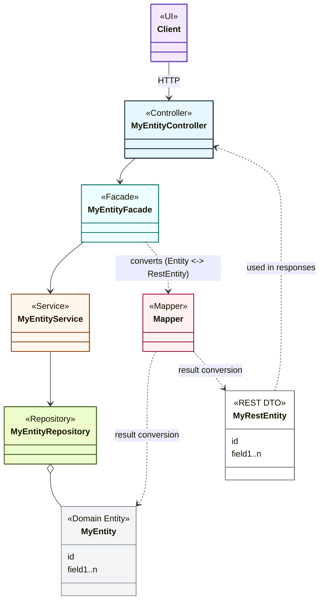

# Architecture Overview

## What and Why

What is a price? A number and a currency symbol, right? Generally speaking, yes. But without the context, it's not entirely clear what it refers to. To which specific amount and unit is it designated? Is the price valid for a specific period of time only? Does the price refer to a promotion or a negotiated contract with a customer? Is VAT already included or not?

As you can see, a price is always embedded in a quite complex context and requires a solution that takes these aspects into account. This microservice based on the Spring Boot Framework provides a first draft solution as a starting point and template for further requirements.

## Functional Features

| id    | Feature                         | Description                                                                                                                     |
|-------|---------------------------------|---------------------------------------------------------------------------------------------------------------------------------|
| FF-01 | RESTful API headless for prices | Prices of a product can be stored, updated and queried via RESTful API                                                          |
| FF-02 | multi currency support          | Prices can be provided and queried for different currencies                                                                     |
| FF-03 | net and gross prices            | Prices can be provided as net or gross prices                                                                                   |
| FF-04 | quantity related prices         | Prices can be provided and queried for different quantities                                                                     |
| FF-05 | prices valid in time ranges     | Prices can be provided and queried in the context of specific time ranges (validFrom, validFrom & validTo, the newest wins)     |
| FF-06 | customer prices                 | Prices can be provided as customer prices, price queries can be executed in customer context                                     |
| FF-07 | prices for promotion groups     | Prices can be provided and queried in promotion group context                                                                   |

## Non-Functional Features

| id    | Feature                                            | Description                                                                                                                          |
|-------|----------------------------------------------------|--------------------------------------------------------------------------------------------------------------------------------------|
| NF-01 | Template for a cloud native price provider service | The project provides a working solution as a starting point and template for a price provider service that can be easily adapted.    |
| NF-02 | Prepared for cloud usage                           | The service is prepared for cloud usage and comes with a Docker file and Helm charts.                                                |
| NF-03 | Prepared for scaling via sharding                  | The service is prepared for databases with sharding capabilities and can be easily adapted.                                          |
| NF-04 | Non secured and secured access                     | Only authenticated and authorized users or applications may access customer related prices.                                          |

## Quality Goals

| id    | Quality Category | Description                                                                                                           |
|-------|------------------|-----------------------------------------------------------------------------------------------------------------------|
| QG-01 | Correctness      | Always provide correct (at least the best fit) query results.                                                         |
| QG-02 | Performance      | Horizontal scaling capabilities to meet growing data volume and traffic requirements.                                 |
| QG-03 | Robustness       | The system shall work reliably under operating conditions. (Kubernetes and Pods)                                      |

## Constraints

### Organizational Constraints

Conway's Law emphasizes the correlation between a system's design and the communication structure of the organization developing it. In the context of the price provider service, this organization consists of a single person with specific skills and interests, which already defines a certain technology stack. This also results in strong restrictions in terms of effort and costs, which limit the feature scope and project objectives.

#### Starter Template

The Pricing Provider Service is designed to serve as a _starter template_ with an emphasis on simplicity and easy extensibility. This design philosophy suits the one-person development team and enables manageable implementation effort. It offers an open platform for later individual extensions, adjustments, and optimization.

### Technical Constraints

#### Technology Stack

Given the organizational context, the technology stack is constrained to Java and the Spring Boot Framework. This selection aligns with the individual's expertise and ensures a cohesive development environment. Other necessary technological decisions will be made and documented based on the results of required research and analysis tasks (see [Architectural Decision Records](020-architectural-decisions.md)).

### Resource and Infrastructure Constraints

Implementation is bound by the availability of only low-cost infrastructure. This constraint shapes the architectural decisions, influencing scalability, and limiting the incorporation of certain desirable features, particularly those associated with non-functional and operational aspects. However, the _starter template_ design philosophy allows consumers of the template to make extensions and customizations as needed.

### Limitations on Feature Implementation and Testing

The constraints outlined above imply that not all desired features, especially those focused on non-functional and operational aspects, can be fully implemented and tested. The emphasis is on delivering a functional and expandable solution that can be created with manageable effort and at low cost.

## Architectural Layers

Dividing data access, services (domain and business logic), DTO conversion, and controllers into distinct layers helps to maintain a well-structured codebase and ensures clear separation of concerns. The price provider service therefore follows this structure.

| Layer       | Package                                              | Responsibility                                                                                                                                                           |
|-------------|------------------------------------------------------|--------------------------------------------------------------------------------------------------------------------------------------------------------------------------|
| Commons     | `de.ebusyness.commons`                               | Shared utilities, interfaces, exception handling                                                                                                                         |
| Data Access | `de.ebusyness.priceproviderservice.dataaccess`       | Repositories, JPA entities, REST clients (external REST access). Typical classes: `(Entity)Repository`, `Entity`, `(View)Projection`                                   |
| Service     | `de.ebusyness.priceproviderservice.service`          | Domain Services, Business Services. Typical classes: `(Entity)Service`, `(Entity)ImportJob`, `(BusinessLogic)Service`                                                   |
| Facade      | `de.ebusyness.priceproviderservice.facade`           | RestEntity mapping, service delegation, response shaping. Typical classes: `(Entity)Facade`, `(Entity)Mapper`, `(Entity)RestEntity`                                     |
| Web         | `de.ebusyness.priceproviderservice.web.controller`   | REST controllers, input validation, API contracts. Typical classes: `(Entity)Controller`, `(Type)Validator`                                                             |

### Layer Diagram

#### Data Access Layer

Contains entity classes and their corresponding repository interfaces or implementations.

#### Service Layer

##### DomainService

Holds domain-specific logic related to entities.

##### BusinessService

Orchestrates and contains broader business logic, potentially integrating various domain services. It encompasses the broader business rules, orchestration, and interactions between multiple domain entities.

##### Job / Scheduler (not yet implemented)

Scheduled jobs are used to perform bulk processing or automated maintenance tasks.

#### Facade Layer

The facade layer acts as an intermediary between the service and controller layers, employing Data Transfer Objects (RestEntities) and Mappers for data exchange. RestEntities streamline communication by reflecting the data, while Mappers facilitate seamless transformation between Entity objects and RestEntities.

#### Controller Layer

Controllers deal with RestEntities for input and output, and the service layer is responsible for converting between RestEntities and domain objects (entities).

## Interface Driven Design (IDD)

This project follows Interface Driven Design (IDD) principles to ensure maintainability, testability, and flexibility. 

### Core IDD Principles

1. **Design by Contract** – Interfaces act as formal contracts between components; they specify expected behavior without revealing internal implementation details.
2. **Separation of Concerns** – Each component focuses on a single responsibility; interfaces help isolate logic.
3. **Loose Coupling** – Components interact via interfaces, not concrete classes, enabling easy testing, mocking, and replacement.

For implementation guidance, see the [Development Guide](../020-development/010-development-guide.md).
