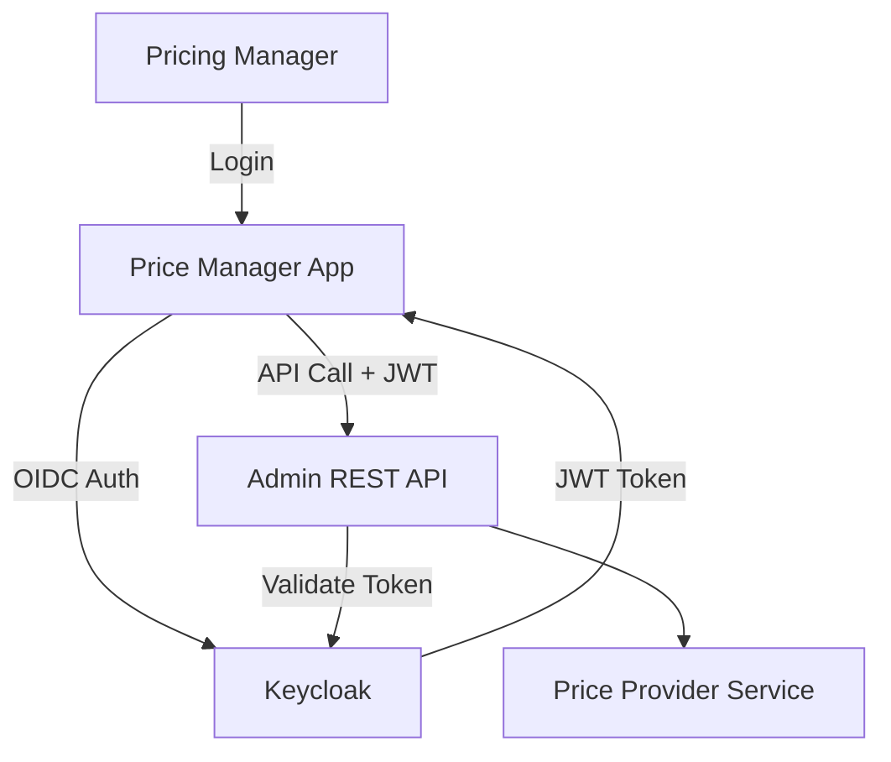
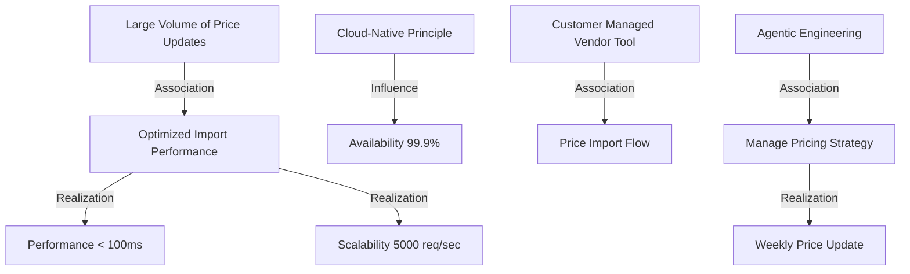
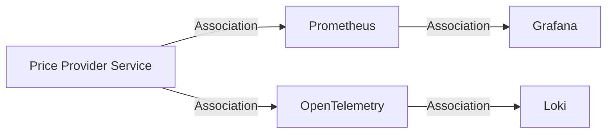

# ArchiMate Documentation

This directory contains the ArchiMate model for the Price Provider project, providing a structured architectural overview across multiple layers.

## ArchiMate Model File

- **File**: `price-provider.archimate`
- **Format**: Archi tool native XML format (compatible with [Archi](https://www.archimatetool.com/)).

## Architectural Views

The ArchiMate model includes the following architectural views. Mermaid diagrams are provided below as a visual reference for each.

### 1. Business Process View
Focuses on how stakeholders interact with pricing processes and services.

### 2. Application Cooperation View
Shows how the different application components interact to provide the pricing solution.

### 3. Import Processing View
Details the flow of data from external pricing tools into the system.

### 4. Deployment View
Models the cloud-native infrastructure setup in Kubernetes.

### 5. Security View
Highlights the authentication and authorization mechanisms.

### 6. Strategy & Motivation View
Traces the business drivers through goals and requirements to strategic capabilities.

### 7. Observability View
Shows the monitoring and logging infrastructure.

### 8. Data Model View
Details the core entities and their relationships within the Price Provider service.
