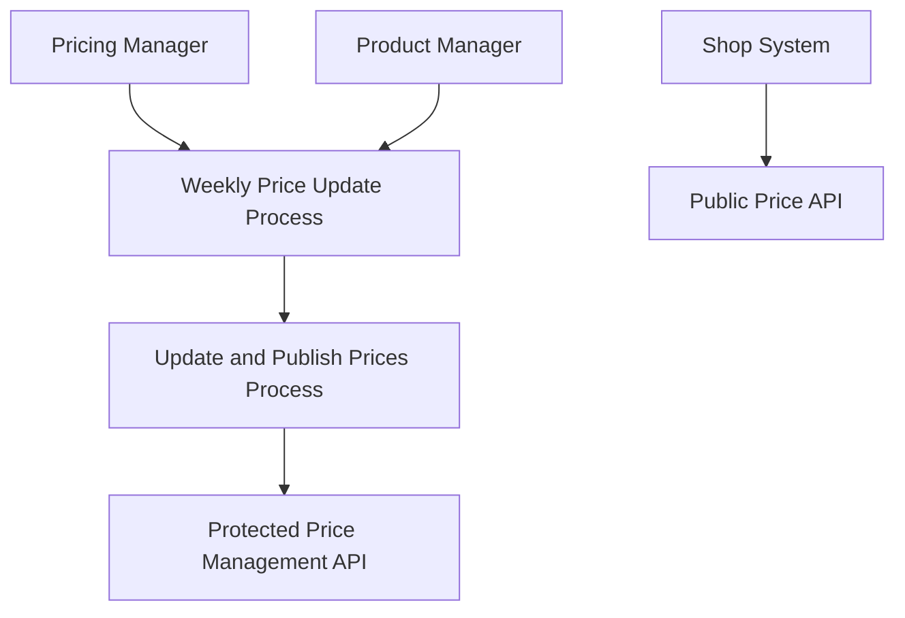
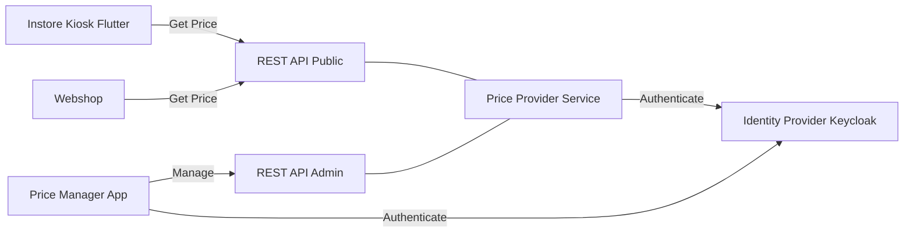
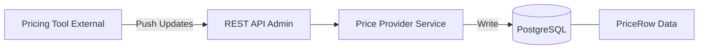
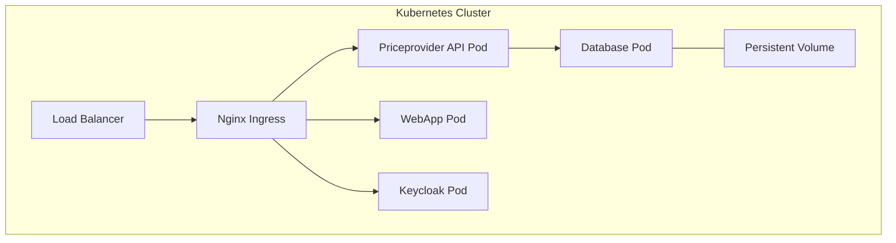
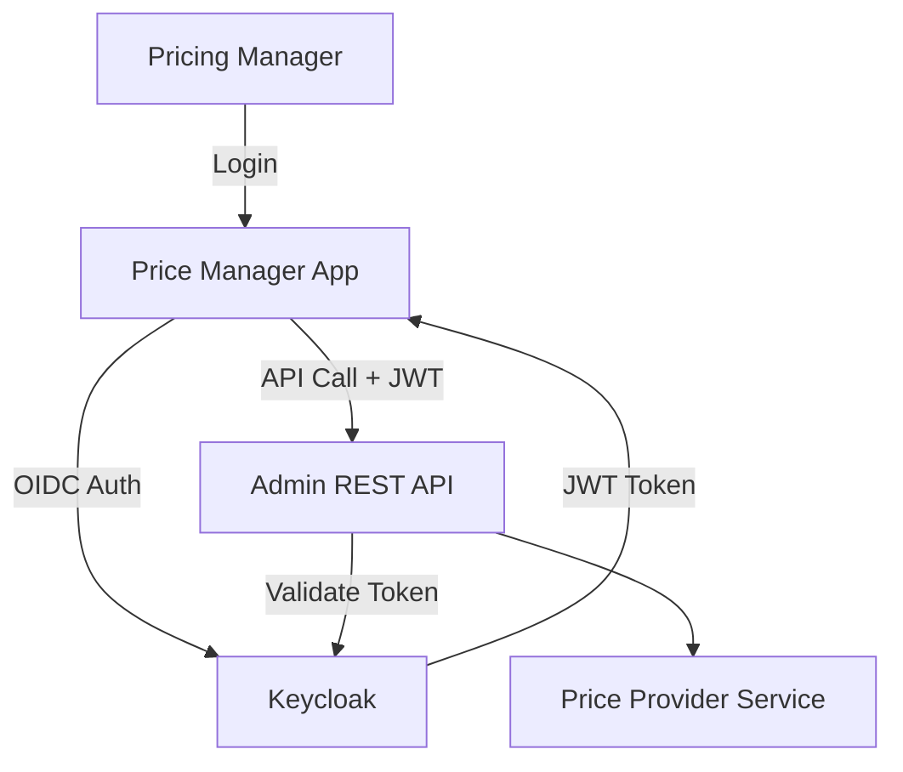

# ArchiMate Documentation

This directory contains the ArchiMate model for the Price Provider project, providing a structured architectural overview across multiple layers.

## ArchiMate Model File

- **File**: `price-provider.archimate`
- **Format**: Archi tool native XML format (compatible with [Archi](https://www.archimatetool.com/)).

## Architectural Views

The ArchiMate model includes the following architectural views. Mermaid diagrams are provided below as a visual reference for each.

### 1. Business Process View
Focuses on how stakeholders interact with pricing processes and services.

### 2. Application Cooperation View
Shows how the different application components interact to provide the pricing solution.

### 3. Import Processing View
Details the flow of data from external pricing tools into the system.

### 4. Deployment View
Models the cloud-native infrastructure setup in Kubernetes.

### 5. Security View
Highlights the authentication and authorization mechanisms.

## Architectural Analysis

### 1. Motivation Layer & NFRs
The architecture is driven by explicit Non-Functional Requirements (NFRs):

| Area | Goal / Requirement | Description |
|------|--------------------|-------------|
| **Availability** | 99.9% | Ensured by Kubernetes orchestration and pod redundancy. |
| **Scalability** | 5000 req/sec | Horizontal scaling of the API Pods. |
| **Performance** | < 100ms | Optimized database queries and read-side caching. |
| **Security** | OAuth2 / OIDC | Identity management via Keycloak and JWT-based authorization. |
| **Reliability** | At-least-once | Guaranteed import processing via robust service logic. |
| **Auditability** | Change History | Full tracking of price changes via auditable entities. |

### 2. Strategy Layer
- **Manage Pricing Strategy**: Agile price updates to react to market dynamics.
- **Weekly Price Update**: Business process for scheduled price adjustments by product segment.
- **Price Import Flow**: Automated ingestion from customer-owned vendor tools.

### 3. Business Layer & Data Model
- **Public Price API**: For consumers (Webshop, Kiosk).
- **Admin API**: Protected interface for management and ingestion.
- **Data Model**: Optimized entities including `PriceRow`, `TaxClass`, `Currency`, `Unit`, `Channel`, and `Group`.

### 4. Application Layer & Integration
- **Observability**: Prometheus, Grafana, Loki, and OpenTelemetry provide full stack monitoring.
- **Integration**: Seamless connection to external PIM systems and vendor-managed Pricing Tools.

### 5. Technology Layer
The deployment is a "basic extendable template" for K8s, featuring automated ingress, load balancing, and redundant storage options.
