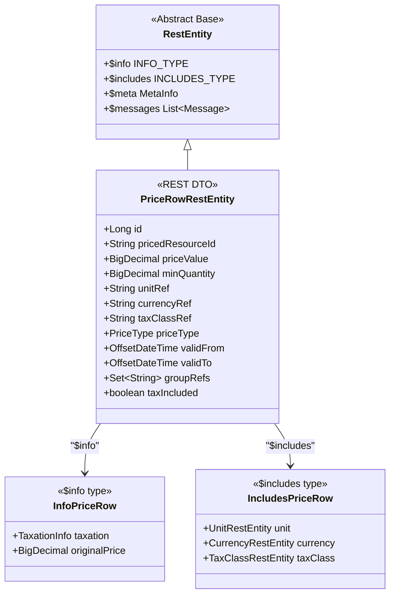
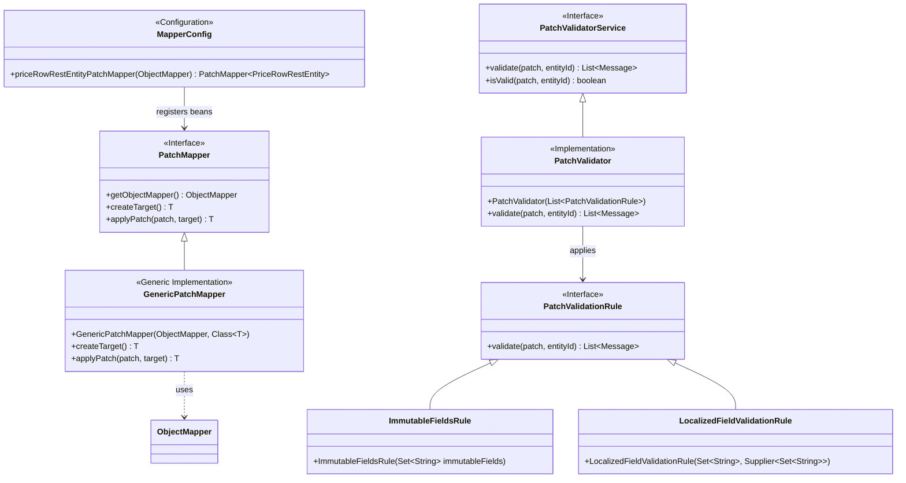
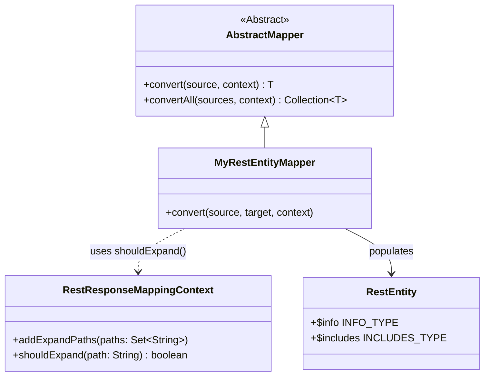

# Development Guide – Facade Layer

The facade layer acts as an intermediary between the service and controller layers. It is responsible for DTO (RestEntity) mapping, service delegation, and response shaping including optional expansions (`$expand`, `$include`, `$meta`, `$messages`).

For an overview of the layering concept, see [Architecture Overview](../010-architecture/010-overview.md#architectural-layers).

## Package Structure

```
io.commercestacksolutions.priceproviderservice.facade/
├── {entity}/
│   ├── {Entity}FacadeService.java        # Interface defining the contract
│   ├── {Entity}FacadeImpl.java           # Default implementation
│   ├── mapper/
│   │   ├── {Entity}RestEntityMapper.java # Entity → RestEntity mapper
│   │   ├── {Entity}EntityMapper.java     # RestEntity → Entity mapper (for write ops)
│   │   └── MapperConfig.java             # PatchMapper bean configuration
│   └── restentity/
│       ├── {Entity}RestEntity.java       # REST DTO (extends RestEntity<Info..., Includes...>)
│       ├── Info{Entity}.java             # $info type (calculated/derived metadata)
│       └── Includes{Entity}.java         # $includes type (optional embedded related data)
```

## RestEntity Generic Structure

All REST entities extend `RestEntity<INFO_TYPE, INCLUDES_TYPE>`. The base class provides the standard `$info`, `$includes`, `$meta`, and `$messages` envelope fields.



### Example REST Entity

```java
public class PriceRowRestEntity extends RestEntity<InfoPriceRow, IncludesPriceRow> {
    private Long id;
    private String pricedResourceId;
    private BigDecimal priceValue;
    // ... domain fields

    // Getters and setters
}
```

- **`INFO_TYPE`**: Type of the `$info` field – calculated/derived metadata (e.g., tax amounts)
- **`INCLUDES_TYPE`**: Type of the `$includes` field – optional embedded related entities

## IDD in the Facade Layer

### Facade Interface Pattern

```java
package io.commercestacksolutions.priceproviderservice.facade.unit;

import com.fasterxml.jackson.databind.JsonNode;
import io.commercestacksolutions.commons.exception.NotFoundException;
import io.commercestacksolutions.commons.mapper.exception.DataMappingException;
import io.commercestacksolutions.priceproviderservice.facade.unit.restentity.UnitListRestEntity;
import io.commercestacksolutions.priceproviderservice.facade.unit.restentity.UnitRestEntity;
import java.util.List;
import java.util.Set;

/**
 * Facade interface for Unit operations.
 */
public interface UnitFacadeService {
    UnitListRestEntity getUnits(int page, int pageSize, List<String> sortBy,
                                String sortDirection, Set<String> expand, String query) throws DataMappingException;
    UnitRestEntity getUnit(String symbol, Set<String> expand) throws NotFoundException, DataMappingException;
    UnitRestEntity patch(String symbol, JsonNode patch) throws NotFoundException, DataMappingException;
    UnitRestEntity createOrRecreate(String symbol, UnitRestEntity unitRestEntity) throws DataMappingException;
    UnitRestEntity create(UnitRestEntity unitRestEntity) throws DataMappingException;
    void delete(String symbol);
    void bulkDeleteUnits(List<String> symbols);
    UnitListRestEntity createOrUpdateAllUnits(List<UnitRestEntity> unitRestEntities) throws DataMappingException;
}
```

### Facade Implementation

```java
@Service
public class UnitFacadeImpl implements UnitFacadeService {

    private final UnitService unitService;
    private final UnitRestEntityMapper unitRestEntityMapper;

    @Autowired
    public UnitFacadeImpl(UnitService unitService, UnitRestEntityMapper unitRestEntityMapper) {
        this.unitService = unitService;
        this.unitRestEntityMapper = unitRestEntityMapper;
    }

    @Override
    public UnitRestEntity getUnit(String symbol, Set<String> expand)
            throws NotFoundException, DataMappingException {
        UnitEntity unit = unitService.getUnit(symbol);
        if (unit == null) {
            throw new NotFoundException("Unit with symbol '" + symbol + "' not found");
        }
        RestResponseMappingContext context = new RestResponseMappingContext();
        context.addExpandPaths(expand);
        return unitRestEntityMapper.convert(unit, context);
    }
    // ... other methods
}
```

### Naming Conventions

| Artifact | Convention | Example |
|----------|-----------|---------|
| Interface | `{Entity}FacadeService` | `UnitFacadeService` |
| Implementation | `{Entity}FacadeImpl` | `UnitFacadeImpl` |
| Alt. implementation | `{Entity}Facade{Variant}Impl` | `UnitFacadeCachedImpl` |

## Mapper Usage & Implementation

To convert between entity and REST entity types, use a mapper class that extends `AbstractMapper`.

### Creating a Mapper

```java
package io.commercestacksolutions.priceproviderservice.facade.myentity.mapper;

import io.commercestacksolutions.commons.mapper.AbstractMapper;
import io.commercestacksolutions.commons.mapper.RestResponseMappingContext;
import io.commercestacksolutions.commons.mapper.exception.DataMappingException;
import io.commercestacksolutions.priceproviderservice.dataaccess.myentity.entity.MyEntity;
import io.commercestacksolutions.priceproviderservice.facade.myentity.restentity.MyRestEntity;
import org.springframework.stereotype.Component;

@Component
public class MyRestEntityMapper extends AbstractMapper<MyEntity, MyRestEntity, RestResponseMappingContext> {

    @Override
    public MyRestEntity createTarget() {
        return new MyRestEntity();
    }

    @Override
    public void convert(MyEntity source, MyRestEntity target, RestResponseMappingContext context)
            throws DataMappingException {
        target.setId(source.getId());
        target.setName(source.getName());
        // Map other fields from MyEntity to MyRestEntity

        // Handle $expand / $includes
        if (context.shouldExpand("$includes.unit")) {
            // populate target.$includes.unit
        }
    }
}
```

## PatchMapper and PatchValidator

PATCH operations (RFC 6902 JSON Patch) require two components working together:
- **`PatchMapper<T>`**: Applies the patch operations to the REST entity (JSON deserialization + Jackson ObjectMapper)
- **`PatchValidator`**: Validates the patch before applying it (checks immutable fields, mandatory localized fields, etc.)

### Architecture



### 1) Register PatchMapper Beans

```java
@Configuration
public class MapperConfig {

    @Bean
    public PatchMapper<PriceRowRestEntity> priceRowRestEntityPatchMapper(ObjectMapper objectMapper) {
        return new GenericPatchMapper<>(objectMapper, PriceRowRestEntity.class);
    }

    @Bean
    public PatchMapper<UnitRestEntity> unitRestEntityPatchMapper(ObjectMapper objectMapper) {
        return new GenericPatchMapper<>(objectMapper, UnitRestEntity.class);
    }
    // Add a bean for every REST entity that needs patch support
}
```

### 2) Inject PatchMapper and PatchValidator into Facades

The facade creates a `PatchValidator` directly in its constructor (not a Spring bean) with the rules applicable to that entity:

```java
@Service
public class UnitFacadeImpl implements UnitFacadeService {

    private final PatchMapper<UnitRestEntity> unitRestEntityPatchMapper;
    private final PatchValidator patchValidator;

    @Autowired
    public UnitFacadeImpl(
            UnitService unitEntityService,
            LanguageService languageEntityService,
            UnitRestEntityMapper unitRestEntityMapper,
            PatchMapper<UnitRestEntity> unitRestEntityPatchMapper,
            UnitEntityMapper unitEntityMapper) {

        this.unitRestEntityPatchMapper = unitRestEntityPatchMapper;

        // PatchValidator is built inline with entity-specific rules
        this.patchValidator = new PatchValidator(List.of(
            new ImmutableFieldsRule(Set.of("symbol")),
            new LocalizedFieldValidationRule(Set.of("name"), this::getMandatoryLanguageCodes)
        ));
    }

    @Override
    public UnitRestEntity patch(String symbol, JsonNode patch)
            throws NotFoundException, DataMappingException {
        // 1. Validate the patch
        List<Message> errors = patchValidator.validate(patch, symbol);
        if (!errors.isEmpty()) {
            throw new DataMappingException("Patch validation failed", new ErrorResponse(errors));
        }

        // 2. Apply the patch to the REST entity
        UnitRestEntity unit = getUnit(symbol, Collections.emptySet());
        unit = unitRestEntityPatchMapper.applyPatch(patch, unit);

        // 3. Convert back to entity and save
        // ...
        return unit;
    }
}
```

For PATCH request examples (JSON Patch format, operations), see [014-development-guide-controller-layer.md](014-development-guide-controller-layer.md#patch-request-examples).

## $expand Feature

The `$expand` query parameter allows clients to request additional data in the response at runtime. The facade reads the expand paths from the `RestResponseMappingContext` and populates the `$info` and `$includes` fields accordingly.

### How It Works



1. The controller receives `$expand` as a query parameter and passes it to the facade
2. The facade creates a `RestResponseMappingContext` and adds the expand paths
3. The mapper's `convert()` method calls `context.shouldExpand("$includes.unit")` to decide which optional data to populate
4. The populated `$includes` / `$info` object is set on the REST entity

### Example Mapper with Expand Logic

```java
@Override
public void convert(PriceRowEntity source, PriceRowRestEntity target,
                    RestResponseMappingContext context) throws DataMappingException {
    target.setId(source.getId());
    target.setPriceValue(source.getPriceValue());
    target.setUnitRef(source.getUnitRef());
    // ...

    if (context.shouldExpand("$includes.unit") || context.shouldExpand("$includes")
            || context.shouldExpand("all")) {
        IncludesPriceRow includes = target.getIncludes() != null
                ? target.getIncludes() : new IncludesPriceRow();
        // populate includes.unit from source.getUnit()
        target.setIncludes(includes);
    }

    if (context.shouldExpand("$info.taxation") || context.shouldExpand("$info")
            || context.shouldExpand("all")) {
        InfoPriceRow info = target.getInfo() != null ? target.getInfo() : new InfoPriceRow();
        // populate info.taxation
        target.setInfo(info);
    }
}
```

### $expand Request Examples

```
GET /admin/api/pricerows/1?$expand=$info.taxation
GET /admin/api/pricerows/1?$expand=$includes.unit
GET /admin/api/pricerows/1?$expand=$info.taxation,$includes.unit,$includes.currency
GET /admin/api/pricerows/1?$expand=$info,$includes
GET /admin/api/pricerows/1?$expand=all
GET /admin/api/pricerows?page=0&page-size=10&$expand=$info.taxation,$includes.unit
```

For the Public Price API expand feature details, see [040-public-price-api/010-integration-guide.md](../030-features/040-public-price-api/010-integration-guide.md).

### Response Without $expand (default)

```json
{
  "id": 1,
  "pricedResourceId": "PROD-123",
  "priceValue": 99.99,
  "minQuantity": 1,
  "unitRef": "pcs",
  "currencyRef": "EUR",
  "taxClassRef": "standard",
  "taxIncluded": false
}
```

### Response With `$expand=$info.taxation`

```json
{
  "id": 1,
  "pricedResourceId": "PROD-123",
  "priceValue": 99.99,
  "unitRef": "pcs",
  "currencyRef": "EUR",
  "taxIncluded": false,
  "$info": {
    "taxation": {
      "taxValue": 19.00,
      "taxRate": 0.19,
      "taxIncludedInfo": "to be added (net)"
    }
  }
}
```

### Response With `$expand=$includes.unit`

```json
{
  "id": 1,
  "pricedResourceId": "PROD-123",
  "priceValue": 99.99,
  "unitRef": "pcs",
  "currencyRef": "EUR",
  "$includes": {
    "unit": {
      "symbol": "pcs",
      "name": { "en": "pieces", "de": "Stück" },
      "measure": "quantity",
      "factor": 1.0
    }
  }
}
```

## `$meta` Expand Parameter

The `$meta` expand keyword returns structural metadata for the entity: identity fields, mandatory fields, and enum values.  Full details are in [060-meta-annotation-concept.md](../030-features/060-meta-annotation-concept.md).

### Usage in facades

Inject `EntityMetaInfoRegistry` and call `setMeta()` whenever the request includes `$meta` in `$expand`:

```java
@Service
public class GroupFacadeImpl implements GroupFacade {

    private final EntityMetaInfoRegistry entityMetaInfoRegistry;

    @Autowired
    public GroupFacadeImpl(..., EntityMetaInfoRegistry entityMetaInfoRegistry) {
        this.entityMetaInfoRegistry = entityMetaInfoRegistry;
    }

    @Override
    public GroupRestEntity getGroup(String id, Set<String> expand) {
        GroupEntity entity = groupService.getGroup(id);
        GroupRestEntity result = groupMapper.convertToRestEntity(entity);

        if (expand != null && expand.contains("$meta")) {
            result.setMeta(entityMetaInfoRegistry.getMetaInfo(GroupEntity.class));
        }
        return result;
    }
}
```

The same pattern applies to list endpoints.

### PATCH validator integration

For entities that support JSON Patch, use `EntityMetaInfoRegistry` to populate the `MandatoryFieldsRule` instead of hardcoding field names:

```java
private PatchValidator getPatchValidator() {
    if (patchValidator == null) {
        MetaInfo meta = entityMetaInfoRegistry.getMetaInfo(MyEntity.class);
        Set<String> mandatoryFields = meta != null && meta.getMandatoryFields() != null
                ? new HashSet<>(meta.getMandatoryFields()) : Collections.emptySet();
        patchValidator = new PatchValidator(List.of(
                new ImmutableFieldsRule(Set.of("id")),
                new MandatoryFieldsRule(mandatoryFields)
        ));
    }
    return patchValidator;
}
```

Note: the validator is initialized lazily (not in the constructor) because `MetaInfoRegistryConfig` populates the registry during `@PostConstruct`, which runs after all bean constructors.
