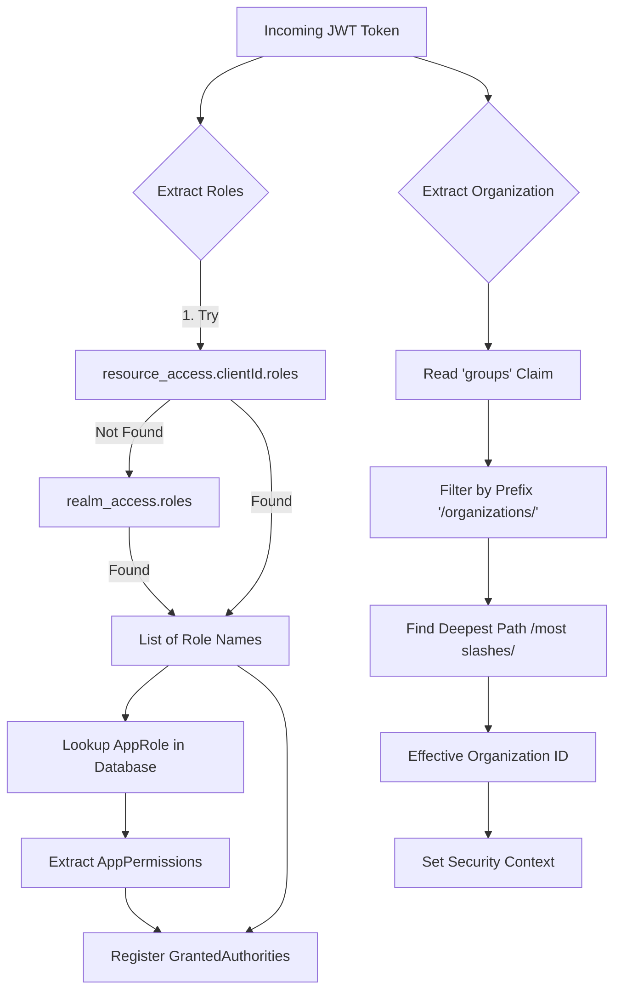

# Security Implementation Guide (Service)

This document provides a technical deep dive into the security implementation of the Price Provider Service.

## Security Configuration

The `SecurityConfig` class in `io.commercestacksolutions.priceproviderservice.config.security` is the entry point for Spring Security. It configures:

- **JWT Decoding**: Validates the JWT access token issued by the Identity Provider.
- **Resource Protection**: Defines which endpoints are public and which require authentication.
- **CORS**: Configures cross-origin resource sharing for browser-based clients.
- **Custom Authentication Converter**: Maps JWT claims into Spring Security authorities.

### JWT Authorities Mapping

To enable `@PreAuthorize` annotations on controllers, the service maps JWT claims into authorities using a custom `JwtAuthenticationConverter`.

-   **Roles**: Maps to `SimpleGrantedAuthority` (e.g., `priceprovider.admin:Admin`).
-   **Permissions**: Maps to `SimpleGrantedAuthority` (e.g., `priceprovider.admin:Channel:read`).

Both roles and permissions are registered so that controllers can check either level of access.

## Claim Extraction

The `JwtClaimsExtractor` component is responsible for extracting roles and organization context from the JWT token. This keeps the authorization logic IDP-agnostic.

### Extraction Logic Flow



### Role Extraction

Role extraction order:
1.  **Client-specific roles**: `resource_access.<clientId>.roles` (preferred).
2.  **Realm roles**: `realm_access.roles` (fallback).

### Organization Extraction

The service uses the `groups` claim to determine the user's organization.

-   **Prefix**: `/organizations/` (configurable).
-   **Logic**: Finds the "deepest" path (most `/` characters) and returns the last segment as the organization ID.
-   **Full Path**: Available via `extractEffectiveOrganizationPath`.

## OIDC Configuration

OIDC settings are managed via `OidcProperties` and can be overridden in `application.yaml`:

```yaml
priceprovider:
  oidc:
    clientId: priceprovider-service
    groupsClaim: groups
    organizationPathPrefix: /organizations/
    resourceAccessRolesPath: "resource_access.{clientId}.roles"
    realmRolesPath: "realm_access.roles"
```

## RBAC Initialization

`AppRole` and `AppPermission` entities are initialized during application startup from the JSON files in `service/src/main/resources/initialize/essential/`.

-   `AppPermission.0010.json`: Defines individual permissions for data types.
-   `AppRole.0010.json`: Groups permissions into logical roles.

These entities are persisted in the database and loaded by `JwtClaimsExtractor` when a token is processed.

## Controller Authorization

Controllers use `@PreAuthorize` to enforce access control based on permissions.

```java
@GetMapping("/{id}")
@PreAuthorize("hasAuthority('priceprovider.admin:Channel:read')")
public RestResponse<ChannelRestEntity> getDetail(@PathVariable String id) {
    ...
}
```

This pattern ensures that security is enforced at the service entry point.
