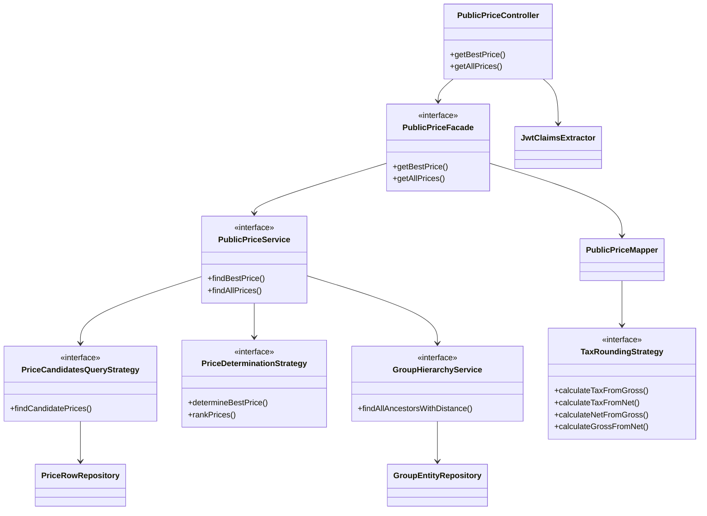

# Public Price API - Developer Guide

## Overview

This guide explains the architecture and extensibility points of the Public Price API. The API is designed following the **Open-Closed Principle** to allow customization without modifying existing code.

## Architecture

### Layer Overview

```
Controller Layer (Web)
    ↓
Facade Layer (REST DTO Mapping)
    ↓
Service Layer (Business Logic)
    ↓
Strategy Layer (Query Building & Price Determination)
    ↓
Data Access Layer (Repositories)
```

### Key Components



### Two-Phase Price Determination

The Public Price API implements a clean separation between **candidate filtering** and **price determination**:

#### Phase 1: Candidate Filtering (Query Strategy)

The `PriceCandidatesQueryStrategy` (default implementation: `DefaultPriceCandidatesQueryStrategy`) performs **database-level filtering** to find all potentially valid price rows:

**Filtering Criteria (DB Level):**
- `pricedResourceId` must match
- `currencyRef` must match
- `priceType` must match
- `unitRef` must match
- `minQuantity` <= requested quantity
- Current date must be within validFrom/validTo range
- Group hierarchy filtering:
  - Without organization context: Only prices WITHOUT group assignments
  - With organization context: Prices with matching group OR parent groups OR no group assignment

**Performance Benefits:**
- Single database query using JPA Criteria API
- 10-100x faster than in-memory filtering
- Optimized for deep group hierarchies (single recursive CTE query via `GroupHierarchyService`)

**Example:** For a request `?quantity=15&unit=piece&currency=EUR` on product `DEMO-PRODUCT-001` with organization `ORG-TECHCORP-GROUP/ORG-TECHCORP-EU/ORG-RETAIL-BERLIN`:
- DB returns only EUR prices in piece units
- Only prices with minQuantity <= 15
- Only prices valid today
- Only prices assigned to: no group, `ORG-TECHCORP-GROUP/ORG-TECHCORP-EU/ORG-RETAIL-BERLIN`, or parent organizations (`ORG-TECHCORP-GROUP/ORG-TECHCORP-EU`, `ORG-TECHCORP-GROUP`)

#### Phase 2: Price Determination (Strategy Pattern)

The `PriceDeterminationStrategy` (default implementation: `DefaultPriceDeterminationStrategy`) takes the pre-filtered candidates and applies **business ranking logic** to determine the best price:

**Ranking Priority:**
1. **Group Distance Level** (lowest wins)
   - Level 0 = price assigned to exact organization (`ORG-TECHCORP-GROUP/ORG-TECHCORP-EU/ORG-RETAIL-BERLIN`)
   - Level 1 = price assigned to direct parent (`ORG-TECHCORP-GROUP/ORG-TECHCORP-EU`)
   - Level 2 = price assigned to grandparent (`ORG-TECHCORP-GROUP`)
   - Level MAX_VALUE = generic price (no group assignment)
2. **Nearest validFrom** (more recent wins)
3. **Nearest minQuantity** (higher wins)

**Group Distance Level Explained:**

The group distance level represents how "close" a price is to the requested organization in the hierarchy:

```
Organization Hierarchy:
ORG-TECHCORP-GROUP (level 2 from RETAIL-BERLIN)
  └─ ORG-TECHCORP-GROUP/ORG-TECHCORP-EU (level 1 from RETAIL-BERLIN)
      └─ ORG-TECHCORP-GROUP/ORG-TECHCORP-EU/ORG-RETAIL-BERLIN (level 0 - exact match)

Generic Price (no group): level = MAX_VALUE
```

### Group Hierarchy Service

The `GroupHierarchyService` uses a single SQL recursive CTE query to retrieve all ancestor groups with their distance levels.

**Interface:**
```java
public interface GroupHierarchyService {
    List<GroupWithDistance> findAllAncestorsWithDistance(String groupId);
}
```

**GroupWithDistance Model:**
```java
public class GroupWithDistance {
    private String groupId;
    private int level;  // 0 = self, 1 = parent, 2 = grandparent, etc.
}
```

## Service Layer

### PublicPriceService

The `PublicPriceService` orchestrates the two-phase price determination process.

**Interface:**
```java
public interface PublicPriceService {
    PriceRowEntity findBestPrice(PriceMatchingCriteria criteria);
    List<PriceRowEntity> findAllPrices(PriceMatchingCriteria criteria);
}
```

**Key Responsibilities:**
- Build group hierarchy (via `GroupHierarchyService`)
- Fetch candidate prices (via `PriceCandidatesQueryStrategy`)
- Determine best price (via `PriceDeterminationStrategy`)
- Transaction management

## Facade Layer

### PublicPriceFacade

The facade layer handles REST-specific concerns:
- Building `PriceMatchingCriteria`
- Mapping entities to REST entities
- Expansion handling

**Interface:**
```java
public interface PublicPriceFacade {
    PublicPriceRestEntity getBestPrice(String channelId, String countryKey, String groupId, ...);
    PublicPriceListRestEntity getAllPrices(String channelId, String countryKey, String groupId, ...);
}
```

## Controller Layer

The controller handles HTTP concerns:
- Request parameter binding
- Organization context extraction from JWT (via `JwtClaimsExtractor`)
- OpenAPI documentation

**URL format:**
```
GET /public/api/channels/{channelId}/countries/{countryIsoKey}/pricedresource/{pricedResourceId}/{priceType}
```

The organization context is implicitly derived from the user's JWT `groups` claim and passed to the facade.

## Integration Testing

To test organization-specific pricing in `WebMvcTest`, use `spring-security-test` to mock a JWT:

```java
mockMvc.perform(get("/public/api/channels/dach-sales-channel/countries/DE/pricedresource/PROD-001/SALES_PRICE")
                .with(jwt().jwt(j -> j.claim("groups", List.of("/organizations/ORG-TECHCORP-GROUP/ORG-TECHCORP-EU/ORG-RETAIL-BERLIN"))))
                .param("quantity", "10.00")
                .param("unit", "piece")
                .param("currency", "EUR"))
```

## Further Reading

- [Public Price API Integration Guide](./010-integration-guide.md)
- [Development Guide](../../020-development/010-development-guide.md)
