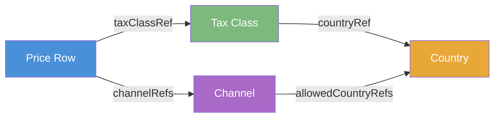

# Channels, Countries, and Pricing — Business Guide

## Overview

This guide explains how **Channels**, **Countries**, **Tax Classes**, and **Price Rows** work together in the Price Provider Service.

---

## The Big Picture

The Price Provider Service uses a geographic pricing model. Every price is linked to a country through its tax class. Every sales channel serves specific countries only.



---

## Domain Concepts

### Country

A **Country** is a geographic territory identified by its ISO Alpha-2 code (e.g., `DE` for Germany, `US` for the United States).

### Tax Class

A **Tax Class** defines the applicable tax rate for a specific country.

### Channel

A **Channel** represents a sales or distribution channel. A channel only serves the countries listed in its `allowedCountryRefs`.

### Price Row

A **Price Row** is a concrete price entry for a product or resource in a specific context.

---

## Business Rules

### Rule 1: A Channel Serves Only Its Allowed Countries

> When a customer requests a price through the Public Price API, the system checks whether the requested country is included in the channel's `allowedCountryRefs`.

### Rule 2: Price Rows Must Be Consistent With Their Channel's Countries

> A price row can only be assigned to a channel if the tax class's country is one of the channel's allowed countries.

---

## How to Request a Price — Public API

All price lookups require both a channel and a country:

```
GET /public/api/{channelId}/{countryIsoKey}/pricerows/{priceType}/of/{pricedResourceId}
```

**Parameters:**
- `channelId`: e.g., `dach-sales-channel`
- `countryIsoKey`: e.g., `DE`
- `pricedResourceId`: your product identifier
- `priceType`: `SALES_PRICE`, `PURCHASE_PRICE`, or `MATERIAL_COST`

Organization context is automatically handled via JWT authentication.

**Example:**
```
GET /public/api/dach-sales-channel/DE/pricerows/SALES_PRICE/of/DEMO-PRODUCT-001
    ?quantity=10&unit=piece&currency=EUR
```
