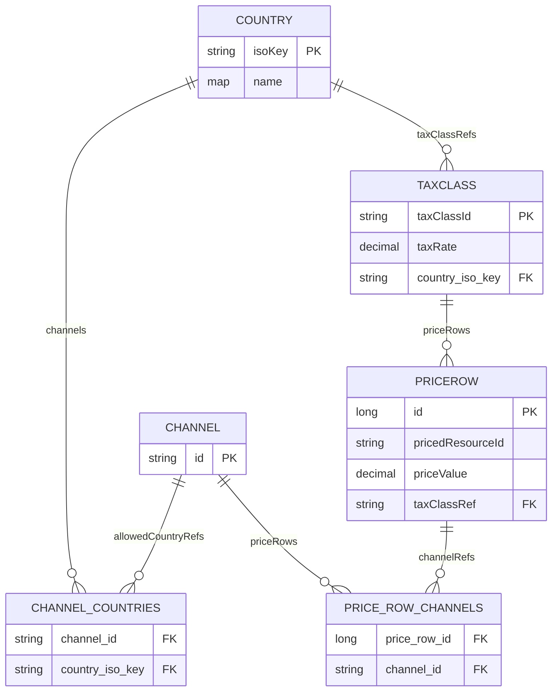
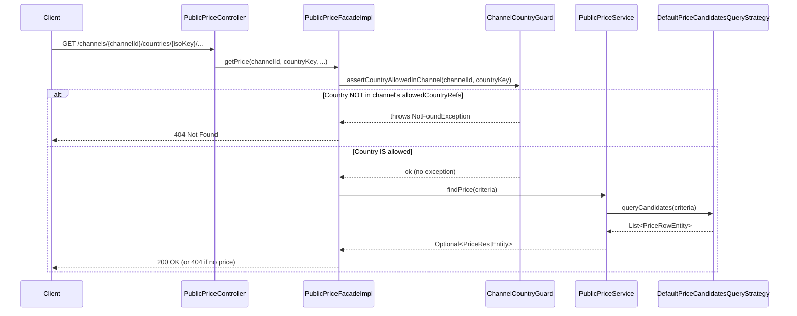
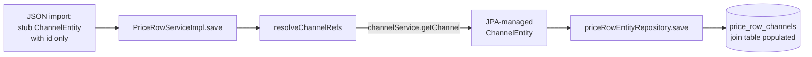

# Channels, Countries, and Pricing — Developer Guide

## Overview

This guide covers the implementation details, architecture, and extensibility points of the channel-country pricing system. It is intended for developers working on or extending the Price Provider Service.

---

## Data Model



---

## Two-Stage Enforcement Architecture

Channel-country consistency is enforced independently at two stages:

### Stage 1 — Public API Guard (Read Path)



#### ChannelCountryGuard
**Class:** `ChannelCountryGuard` (interface) / `DefaultChannelCountryGuard` (default implementation)

**Location:** `io.commercestacksolutions.priceproviderservice.facade.publicprice`

**Responsibility:** Reject price requests for countries that are not in the channel's `allowedCountryRefs` before any database query is issued.

**Behavior:**
- Reads the channel via `ChannelService.getChannel(channelId)`
- Checks if `countryKey` is in `channel.allowedCountryRefs`
- If not, throws `NotFoundException` (→ 404 Not Found for single-price endpoints)
- Channels with an empty `allowedCountryRefs` set are treated as unrestricted (all countries allowed)

The `ChannelCountryGuard` interface is the extensibility point for the channel-country access check:

```java
public interface ChannelCountryGuard {
    void assertCountryAllowedInChannel(String channelId, String countryKey) throws NotFoundException;
}
```

---

#### DefaultPriceCandidatesQueryStrategy — Channel and Country Filtering

The `DefaultPriceCandidatesQueryStrategy` applies channel and country filters using JPA Criteria API:

**Channel filter** — includes prices with no channel assignment (generic) OR prices assigned to the requested channel:
```java
if (channelId != null && !channelId.isEmpty()) {
    Join channelJoin = priceRow.join("channelRefs", JoinType.LEFT);
    predicates.add(cb.or(
        cb.isEmpty(priceRow.get("channelRefs")),
        channelJoin.get("id").in(channelId)
    ));
}
```

**Country filter** — traverses `priceRow → taxClassRef → countryRef`:
```java
if (countryKey != null && !countryKey.isEmpty()) {
    Join taxClassJoin = priceRow.join("taxClassRef", JoinType.LEFT);
    Join countryJoin = taxClassJoin.join("countryRef", JoinType.LEFT);
    predicates.add(cb.equal(countryJoin.get("isoKey"), countryKey));
}
```

### Stage 2 — PriceRow Validation Rule (Write Path / Admin API)

#### ChannelCountryConsistencyRule

**Location:** `io.commercestacksolutions.priceproviderservice.service.pricerow.validation`

**Responsibility:** Ensure a price row's tax class country is allowed in every assigned channel. Reject any `save()` call for a price row where the tax class's country is not in every referenced channel's `allowedCountryRefs`.

**Logic:**
```
For each channel in priceRow.channelRefs:
    if channel.allowedCountryRefs is not empty:
        if priceRow.taxClassRef.countryRef is not null:
            assert priceRow.taxClassRef.countryRef in channel.allowedCountryRefs
```

**Message key:** `common.errors.validation.priceRowChannelCountryMismatch`

---

#### TaxClassMandatoryCountryAssignmentRule

**Location:** `io.commercestacksolutions.priceproviderservice.service.taxclass.validation`

**Responsibility:** Ensure every `TaxClassEntity` has a non-null, non-empty `countryRef` before it is saved.

```java
@Component
public class TaxClassMandatoryCountryAssignmentRule implements ValidationRule<TaxClassEntity> {
    @Override
    public void validate(TaxClassEntity entity) throws EntityValidationException {
        if (entity.getCountryRef() == null || entity.getCountryRef().isEmpty()) {
            throw new EntityValidationException(MessageKeys.ERROR_VALIDATION_TAXCLASS_COUNTRY_MANDATORY);
        }
    }
}
```

**Message key:** `common.errors.validation.taxClassCountryMandatory`


---

### PriceRow Channel Resolution During Import

When price rows are imported from JSON (`PriceRowDataImporter`), the `channelRefs` field is deserialized as a `Set<String>` via a `@Transient` setter. This creates stub `ChannelEntity` objects with only the `id` set — they are not JPA-managed.

To avoid a `TransientObjectException` when Hibernate tries to insert into the `price_row_channels` join table, `PriceRowServiceImpl.save()` calls `resolveChannelRefs()` before persisting:



---


## Data Import Order

Setup data is loaded in priority order to satisfy foreign key dependencies:

| Priority | Importer              | Loads       | Dependency          |
|----------|-----------------------|-------------|---------------------|
| 50       | `LanguageDataImporter` | Languages   | —                   |
| 60       | `CurrencyDataImporter` | Currencies  | —                   |
| 65       | `CountryDataImporter`  | Countries   | —                   |
| 70       | `TaxClassDataImporter` | Tax Classes | Countries must exist |
| 80       | `ChannelDataImporter`  | Channels    | Countries must exist |
| 100      | `UnitDataImporter`     | Units       | —                   |
| (last)   | `PriceRowDataImporter` | Price Rows  | TaxClasses + Channels must exist |

---


