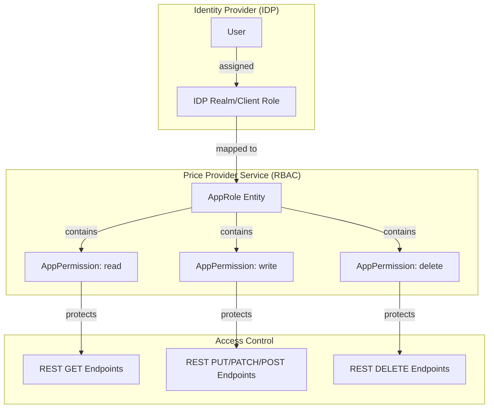
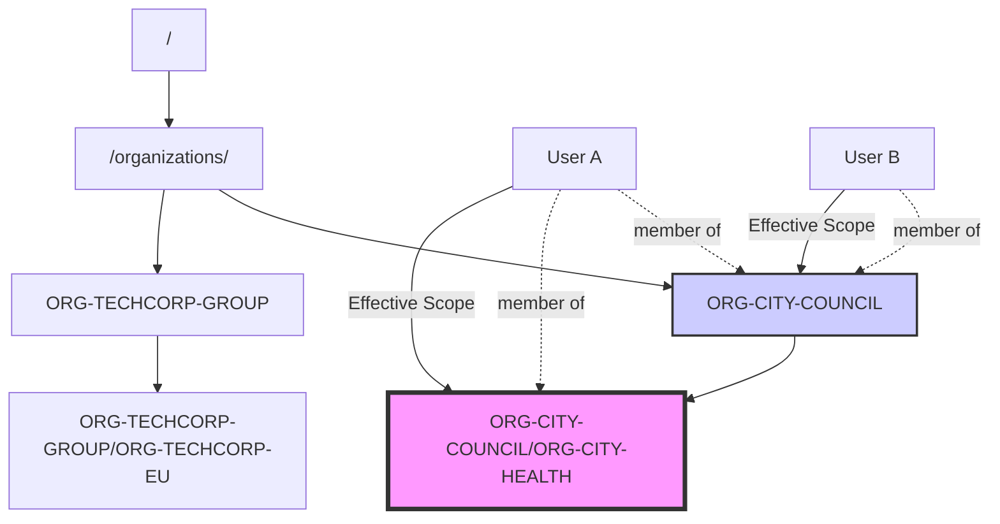

# RBAC and User Guide

This guide provides an overview of the Role-Based Access Control (RBAC) model, sample users, and the organization concept in the Price Provider Service.

## RBAC Model

The system uses a fine-grained RBAC model where **AppPermissions** are assigned to **AppRoles**. Users are then assigned roles in the Identity Provider (Keycloak), which the application maps back to permissions.

### App Roles

Defined in `AppRole.0010.json`:

- **priceprovider.admin:Superuser**: All permissions, including managing AppPermissions and AppRoles.
- **priceprovider.admin:Admin**: Full admin access to all data types.
- **priceprovider.admin:Contributor**: Read and write access to all data types.
- **priceprovider.admin:Reader**: Read-only access to all data types.
- **priceprovider.admin:ChannelContributor**: Full access to channels only.
- **priceprovider.public:PriceRowReader**: Access to the public price API, scoped by organization.
- **priceprovider.public:PriceRowInspector**: Access to public price API including candidate inspection endpoint, scoped by organization.

The admin role remains protected from AppPermission write/delete operations to prevent accidental permission loss. Use the superuser role when permission maintenance is required.

### App Permissions

Defined in `AppPermission.0010.json`, permissions follow the pattern `priceprovider.<scope>:<DataType>:<Action>`.

Examples:
- `priceprovider.admin:Channel:read`
- `priceprovider.admin:PriceRow:write`
- `priceprovider.admin:Unit:delete`
- `priceprovider.public:PriceRow:read`
- `priceprovider.public:PriceRow:inspect`

### RBAC Hierarchy

The following diagram illustrates the relationship between IDP Roles, Application Roles, and App Permissions:

## Sample Users

The following sample users are pre-configured in the `priceprovider` realm (`idp/keycloak/realm-export.json`):

| Username | Password | Role | Description |
|----------|----------|------|-------------|
| `super-user` | `superuser123` | `priceprovider.admin:Superuser` | Unrestricted access, including AppPermission management. |
| `admin-user` | `admin123` | `priceprovider.admin:Admin` | Full system administrator. |
| `contributor-user` | `contributor123` | `priceprovider.admin:Contributor` | Editor for all master data. |
| `reader-user` | `reader123` | `priceprovider.admin:Reader` | Read-only access for auditing. |
| `customer-city-council-inspector` | `customer123` | `priceprovider.public:PriceRowInspector` | Scoped to `ORG-CITY-COUNCIL` with candidate inspection access. |
| `customer-city-council` | `customer123` | `priceprovider.public:PriceRowReader` | Scoped to `ORG-CITY-COUNCIL`. |
| `customer-city-health` | `customer123` | `priceprovider.public:PriceRowReader` | Scoped to `ORG-CITY-COUNCIL/ORG-CITY-HEALTH`. |
| `customer-techcorp` | `customer123` | `priceprovider.public:PriceRowReader` | Scoped to `ORG-TECHCORP-GROUP/ORG-TECHCORP-EU`. |

## Organizations (Groups)

Organizations are defined as hierarchical groups in Keycloak under the `/organizations` path.

Example hierarchy:
- `/organizations/ORG-CITY-COUNCIL`
    - `/organizations/ORG-CITY-COUNCIL/ORG-CITY-HEALTH`
- `/organizations/ORG-TECHCORP-GROUP/ORG-TECHCORP-EU`

When a user logs in, the service extracts the "deepest" organization group path from the `groups` claim. For example, a user in both `/organizations/ORG-CITY-COUNCIL` and `/organizations/ORG-CITY-COUNCIL/ORG-CITY-HEALTH` will be scoped to `ORG-CITY-COUNCIL/ORG-CITY-HEALTH`.

### Organization Hierarchy and Scope

The diagram below shows the organization hierarchy and how the "deepest path" logic determines the organization scope for a user:

## Shop Frontend Demo

The **Shop Frontend Demo** (located in `examples/shopfrontend`) illustrates how to use the Public Price API with organization-based filtering.

It demonstrates:
1.  **OIDC Login**: Authenticating as a customer user.
2.  **Organization Context**: Passing the organization identifier to the Price Provider Service.
3.  **Scoped Price Access**: Only viewing prices configured for the user's organization or its parent organizations.

The demo can be started using the provided `docker-compose.yml` in the root directory.
