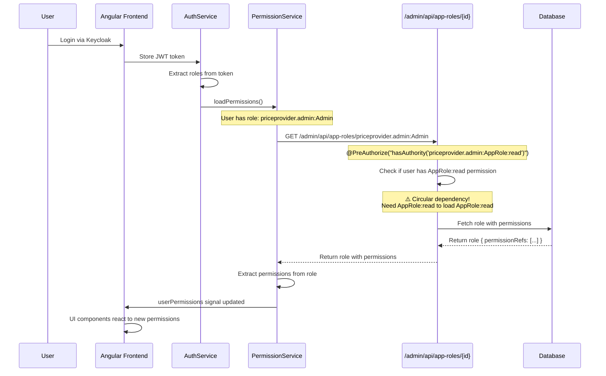

# Service Initialization and Bootstrap

This guide explains the GUI-based service initialization feature and the automatic bootstrap mechanism that enables initial access to a fresh installation.

## Overview

The Price Provider Service supports manual data loading through a GUI interface instead of automatic data loading on startup. This allows administrators to:

- Control when initial data is loaded
- Select between essential data and sample data
- Load data on-demand via the Service Initialization page in the Angular frontend

To enable this manual initialization workflow, the service includes a **bootstrap mechanism** that automatically creates minimal permissions and roles when the database is completely empty.

## Bootstrap Mechanism

### Purpose

When the service starts with an empty database (no permissions and no roles exist), it faces a "chicken-and-egg" problem:

1. The Service Initialization page requires the `priceprovider.admin:ServiceInitialization:write` permission
2. To load permissions, the frontend needs to fetch role details via the `/admin/api/app-roles/{id}` endpoint
3. This endpoint requires the `priceprovider.admin:AppRole:read` permission
4. But no permissions or roles exist yet in the database

The bootstrap mechanism solves this by automatically creating:

- Two essential permissions
- One admin role with both permissions

### Bootstrap Process

The bootstrap logic runs automatically at service startup via `@PostConstruct` in `SetupDataImportManager`:

```java
@PostConstruct
@Override
public void loadData() {
    // Bootstrap: Create minimal permission and role if database is empty
    bootstrapMinimalAccess();

    // Only auto-load if configured to do so
    if (Boolean.TRUE.equals(essentialDataOn)) {
        loadEssentialData();
    }

    if (Boolean.TRUE.equals(sampleDataOn)) {
        loadSampleData();
    }
}
```

The `bootstrapMinimalAccess()` method checks if the database is empty and creates the minimal setup:

```java
private void bootstrapMinimalAccess() {
    try {
        // Check if database is empty (no permissions and no roles)
        boolean hasPermissions = !appPermissionService.getAllAppPermissions().isEmpty();
        boolean hasRoles = !appRoleService.getAllAppRoles().isEmpty();

        if (!hasPermissions && !hasRoles) {
            logger.info("Database is empty. Creating bootstrap permission and role for service initialization.");

            // Create the ServiceInitialization permission
            AppPermissionEntity initPermission = new AppPermissionEntity();
            initPermission.setId("priceprovider.admin:ServiceInitialization:write");
            initPermission.setDescription("Initialize service data");
            appPermissionService.save(initPermission);

            // Create the AppRole:read permission (needed to load roles)
            AppPermissionEntity roleReadPermission = new AppPermissionEntity();
            roleReadPermission.setId("priceprovider.admin:AppRole:read");
            roleReadPermission.setDescription("Read app roles");
            appPermissionService.save(roleReadPermission);

            // Create the Admin role with both permissions
            AppRoleEntity adminRole = new AppRoleEntity();
            adminRole.setId("priceprovider.admin:Admin");
            adminRole.setDescription("Full admin access");
            Set<AppPermissionEntity> permissions = new HashSet<>();
            permissions.add(initPermission);
            permissions.add(roleReadPermission);
            adminRole.setPermissionRefs(permissions);
            appRoleService.save(adminRole);

            logger.info("Created role: {} with bootstrap permissions", adminRole.getId());
            logger.info("Bootstrap complete. Admin users can now access the service initialization page.");
        }
    } catch (Exception e) {
        logger.error("Error during bootstrap: {}", e.getMessage(), e);
    }
}
```

### Bootstrap Creates

| Type | ID | Description | Purpose |
|------|----|----|---------|
| Permission | `priceprovider.admin:ServiceInitialization:write` | Initialize service data | Required to access the Service Initialization page |
| Permission | `priceprovider.admin:AppRole:read` | Read app roles | Required to load user's role details and permissions |
| Role | `priceprovider.admin:Admin` | Full admin access | Container for the bootstrap permissions |

## Initial Setup Workflow

### 1. Fresh Installation

When you install the service for the first time with an empty database:

1. Start the service
2. Bootstrap automatically creates the minimal role and permissions
3. Logs confirm: `Bootstrap complete. Admin users can now access the service initialization page.`

### 2. Keycloak Configuration

The bootstrap mechanism **only creates the role in the database**. You must still assign the role to users in Keycloak:

1. Log in to Keycloak Admin Console
2. Navigate to the `priceprovider` realm
3. Create or select a user (e.g., `admin-user`)
4. Assign the role `priceprovider.admin:Admin` to the user

**Important**: The role name in Keycloak must **exactly match** the role ID in the database: `priceprovider.admin:Admin`

### 3. Access Service Initialization

Once the user has the `priceprovider.admin:Admin` role assigned in Keycloak:

1. Log in to the Angular frontend
2. The Service Initialization page will be accessible
3. Use the interface to load essential data and/or sample data

## Permission Loading Flow

Understanding how permissions are loaded helps explain why both bootstrap permissions are needed:



### Why AppRole:read is Required

The frontend's `PermissionService.loadPermissions()` method fetches role details to extract permissions:

```typescript
loadPermissions(): void {
    const roles = this.authService.userRoles();
    if (!roles.length) {
        this.userPermissions.set(new Set());
        this.loading.set(false);
        return;
    }

    this.loading.set(true);
    const roleRequests = roles.map(roleId =>
        this.appRolesService.getAppRole(roleId).pipe(  // ← Calls /admin/api/app-roles/{id}
            map(role => role.permissionRefs ?? []),
            catchError(() => of([] as string[]))
        )
    );

    forkJoin(roleRequests).subscribe({
        next: (permissionArrays) => {
            const allPermissions = new Set<string>();
            permissionArrays.forEach(perms => perms.forEach(p => allPermissions.add(this.normalizePermission(p))));
            this.userPermissions.set(allPermissions);
            this.loading.set(false);
        }
    });
}
```

The `/admin/api/app-roles/{id}` endpoint requires `AppRole:read` permission:

```java
@GetMapping("/{id}")
@PreAuthorize("hasAuthority('priceprovider.admin:AppRole:read')")
public AppRoleDTO getAppRole(@PathVariable String id, @RequestParam(value = "$expand", required = false) String expand) throws Exception {
    // ...
}
```

Without `AppRole:read` in the bootstrap role, users would be unable to load their own permissions, creating a circular dependency.

## Configuration

The service initialization behavior is controlled by properties in `application.yaml`:

```yaml
service-config:
  initialize:
    data-folder: "classpath:data/"
    essential-data-on: false  # Do not auto-load essential data
    sample-data-on: false     # Do not auto-load sample data
```

- `essential-data-on: false` - Disables automatic loading of essential data (roles, permissions, channels, etc.)
- `sample-data-on: false` - Disables automatic loading of sample data
- `data-folder` - Location of JSON data files for manual loading

## Troubleshooting

### "No administrator access" (Kein Administrator-Zugriff)

**Symptom**: User logs in successfully but sees an error message and cannot access the Service Initialization page.

**Causes**:

1. **User missing role in Keycloak**
   - Check: Is the user assigned the `priceprovider.admin:Admin` role in Keycloak?
   - Fix: Assign the role in Keycloak Admin Console

2. **Role name mismatch**
   - Check: Does the Keycloak role name exactly match `priceprovider.admin:Admin`?
   - Fix: Rename the role in Keycloak to match exactly (case-sensitive)

3. **Bootstrap didn't run**
   - Check: Look for bootstrap log messages in service startup logs
   - Expected: `Bootstrap complete. Admin users can now access the service initialization page.`
   - Fix: Ensure database is truly empty (no permissions AND no roles)

### Bootstrap not creating permissions

**Symptom**: Service starts but bootstrap permissions are not created.

**Causes**:

1. **Database not empty**
   - Bootstrap only runs when BOTH permissions AND roles tables are empty
   - Check: Query the database for existing permissions or roles
   - Fix: Clear both tables if you need to re-run bootstrap

2. **Bootstrap error**
   - Check: Look for error logs: `Error during bootstrap: ...`
   - Fix: Investigate the exception in the logs

### Cannot load roles after login

**Symptom**: User logs in but permissions don't load, Service Initialization page not accessible.

**Cause**: Missing `AppRole:read` permission in the bootstrap role (should not happen with current code).

**Fix**: Verify the bootstrap role contains both permissions:
```sql
SELECT * FROM app_permission WHERE id IN (
    'priceprovider.admin:ServiceInitialization:write',
    'priceprovider.admin:AppRole:read'
);

SELECT * FROM app_role WHERE id = 'priceprovider.admin:Admin';

SELECT * FROM app_role_app_permission
WHERE app_role_entity_id = 'priceprovider.admin:Admin';
```

## Related Documentation

- [RBAC and User Guide](050-rbac-and-user-guide.md) - Understanding the full RBAC model
- [Security Implementation Guide](../020-development/021-security-implementation-guide.md) - Technical security details
- [Data Access Layer](../020-development/011-development-guide-data-access-layer.md) - Data initialization patterns
