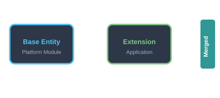
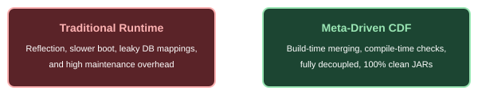
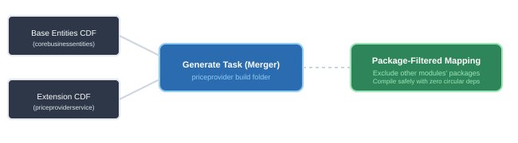

# Extensible Platform
### Build-Time Entity Extension via CDF

<!--
Welcome everyone. Today we are presenting the new Extensible Microservice Platform concept, specifically detailing how we extend database entities and REST facade representations cleanly at build-time using Class Definition Format (CDF) descriptors.
-->

---

## Decoupling the Schema

**Class Definition Files (CDF):** Meta-driven, zero runtime overhead, and clean upgrade paths.

<!--
On this slide, we contrast traditional extension approaches with our build-time CDF pattern.
Instead of using Hibernate polymorphic mappings or runtime reflection which cause significant performance penalties and leak domain concepts across modules, CDF uses a declarative JSON schema. This ensures clean JARs and zero reflection overhead at runtime, while keeping our upgrade paths fully intact.
-->

---

## CDF - Declarative JSON Format

* Class package, target superClass, and imports.
* Accessor fields with annotations.
* Direct injection of custom Java methods & constructors.

<!--
Here we look at the structure of a CDF file. It is a highly structured JSON file representing all package paths, target class details, annotations, fields, and custom behaviors. Out of these files, standard JPA entity classes and REST RestEntities are generated, fully automated by our build plugin.
-->

---

## Merging Architecture
* Multi-project definitions merged centrally.
* Package-filtered source directories for each subproject.
* Zero compile-time circular dependency loops.

<!--
This is the core build-time flow. All CDF JSON files across different projects are scanned centrally during the build of our leaf application service (priceprovider).
The plugin merges base schemas with service-specific extensions. It then outputs them back to the platform modules' source sets using precise, package-filtered directory mapping. This successfully keeps our dependencies strictly one-directional.
-->

